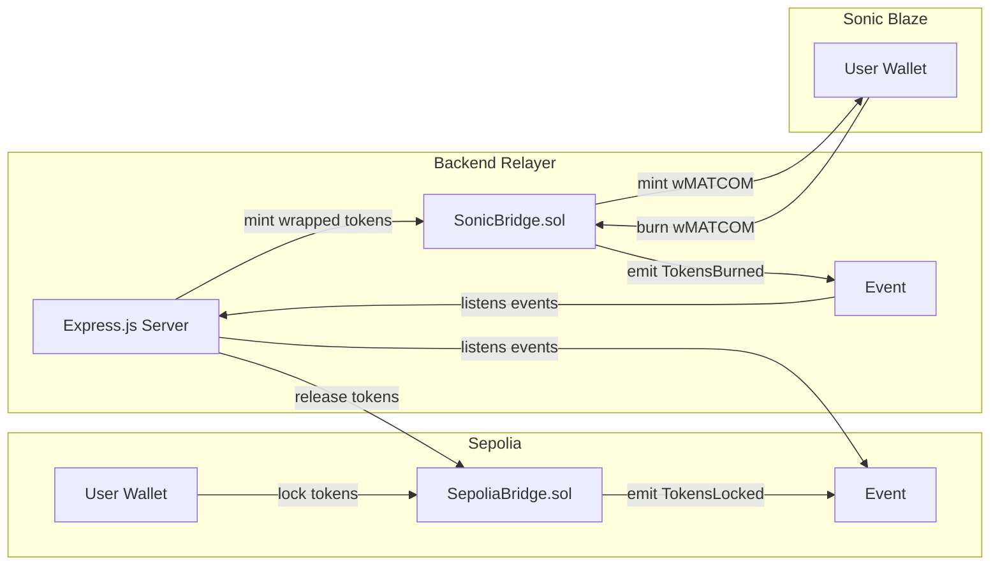

# MATCOM Bridge — Sepolia ↔ Sonic Blaze Testnet

A cross-chain token bridge enabling seamless transfers between Ethereum Sepolia and Sonic Blaze testnet using a **Lock/Mint + Burn/Release** architecture with an off-chain relayer backend.

## Network Details

| Property | Sepolia | Sonic Blaze |
|---|---|---|
| **Chain ID** | `11155111` | `57054` |
| **RPC URL** | `https://rpc.sepolia.org` | `https://rpc.blaze.soniclabs.com` |
| **Currency** | SepoliaETH | S |
| **Explorer** | sepolia.etherscan.io | testnet.sonicscan.org |

## Architecture Overview

**Flow:**
1. **Sepolia → Sonic:** User locks MATCOM tokens on Sepolia → Relayer detects `TokensLocked` → Relayer mints wrapped MATCOM (wMATCOM) on Sonic Blaze
2. **Sonic → Sepolia:** User burns wMATCOM on Sonic → Relayer detects `TokensBurned` → Relayer releases original MATCOM on Sepolia

---

## Proposed Changes

### Blockchain (`blockchain/`)

The smart contracts deployed to both chains, built with Hardhat.

#### [NEW] blockchain/package.json
- Hardhat, ethers.js v6, OpenZeppelin contracts, dotenv

#### [NEW] blockchain/hardhat.config.js
- Network configs for Sepolia (chainId 11155111) and Sonic Blaze (chainId 57054)
- Compiler: solc 0.8.20

#### [NEW] blockchain/contracts/BridgeToken.sol
- ERC20 token "MATCOM" (MCM) with:
  - Initial supply minted to deployer (1,000,000 tokens)
  - Standard ERC20 functionality
  - Deployed only on Sepolia (source chain)

#### [NEW] blockchain/contracts/SepoliaBridge.sol
- `lockTokens(uint256 amount)`: Transfers tokens from user to contract, emits `TokensLocked(address sender, uint256 amount, uint256 nonce)`
- `releaseTokens(address to, uint256 amount, uint256 nonce)`: Only callable by relayer, releases locked tokens back, with nonce replay protection
- `setRelayer(address)`: Owner sets the relayer address
- Tracks processed nonces to prevent replay attacks

#### [NEW] blockchain/contracts/WrappedToken.sol
- ERC20 "Wrapped MATCOM" (wMCM) on Sonic Blaze
- `mint(address to, uint256 amount)`: Only callable by bridge contract
- `burn(uint256 amount)`: Burns tokens from caller

#### [NEW] blockchain/contracts/SonicBridge.sol
- `mintWrapped(address to, uint256 amount, uint256 nonce)`: Only callable by relayer, mints wMATCOM, replay protection via nonce
- `burnWrapped(uint256 amount)`: Burns user's wMATCOM, emits `TokensBurned(address sender, uint256 amount, uint256 nonce)`
- `setRelayer(address)`: Owner sets the relayer address

#### [NEW] blockchain/scripts/deploy-sepolia.js
- Deploys BridgeToken + SepoliaBridge to Sepolia
- Sets bridge allowance, outputs addresses

#### [NEW] blockchain/scripts/deploy-sonic.js
- Deploys WrappedToken + SonicBridge to Sonic Blaze
- Grants minting role to SonicBridge, outputs addresses

---

### Backend (`backend/`)

Express.js relayer server that monitors events on both chains and processes cross-chain transfers.

#### [NEW] backend/package.json
- express, ethers v6, cors, dotenv, winston (logging)

#### [NEW] backend/.env
- Private key, RPC URLs, contract addresses (filled after deployment)

#### [NEW] backend/src/server.js
- Express server on port 3001
- CORS enabled for frontend
- Health check endpoint
- Transaction status tracking endpoint

#### [NEW] backend/src/relayer.js
- **Sepolia Listener**: Watches `TokensLocked` events on SepoliaBridge → calls `mintWrapped()` on SonicBridge
- **Sonic Listener**: Watches `TokensBurned` events on SonicBridge → calls `releaseTokens()` on SepoliaBridge
- Nonce tracking for idempotency
- Error handling with retries
- Transaction status stored in-memory (Map)

#### [NEW] backend/src/routes/bridge.js
- `GET /api/status`: Server health + connected chains
- `GET /api/transactions`: List recent bridge transactions
- `GET /api/transactions/:hash`: Get specific transaction status
- `POST /api/bridge/estimate`: Estimate gas fees for bridging

---

### Frontend (`frontend/`)

Vite + vanilla JS (or React) SPA with premium dark glassmorphism UI.

#### [NEW] frontend/package.json
- Vite, React, ethers v6, react-router-dom

#### [NEW] frontend/index.html
- Root HTML with meta tags, Google Fonts (Inter)

#### [NEW] frontend/src/main.jsx
- React entry point

#### [NEW] frontend/src/App.jsx
- Main app with router, wallet context

#### [NEW] frontend/src/index.css
- Design system: dark theme, glassmorphism cards, gradients, animations
- CSS custom properties for colors, spacing, typography
- Responsive breakpoints

#### [NEW] frontend/src/components/Header.jsx
- Logo, navigation, wallet connect button
- Network indicator (Sepolia / Sonic Blaze)
- Connected address display with truncation

#### [NEW] frontend/src/components/BridgeCard.jsx
- Source/destination chain selector with swap button
- Token amount input
- Balance display
- "Bridge" action button
- Fee estimation display

#### [NEW] frontend/src/components/TransactionHistory.jsx
- List of recent bridge transactions
- Status indicators (pending, confirming, completed, failed)
- Links to block explorers

#### [NEW] frontend/src/components/NetworkSwitcher.jsx
- Dropdown to switch between Sepolia and Sonic Blaze
- Auto-detection of current network

#### [NEW] frontend/src/utils/constants.js
- Chain configs, contract addresses, ABIs

#### [NEW] frontend/src/utils/contracts.js
- Ethers.js contract interaction helpers
- Lock, burn, approve functions

---

## User Review Required

> [!IMPORTANT]
> **Private Key Exposure**: The provided private key will be used as the relayer's signing key in the backend. It will be stored in a `.env` file. This key will pay gas fees on both chains — ensure it has testnet ETH on Sepolia and testnet S on Sonic Blaze.

> [!WARNING]
> **Testnet Faucets Required**: Before bridging works, the relayer wallet needs:
> - Sepolia ETH from a faucet (for gas on Sepolia)
> - Sonic Blaze S tokens from a faucet (for gas on Sonic)

> [!NOTE]
> **Token Design**: We'll deploy a custom ERC20 "MATCOM" (MCM) on Sepolia as the source token, and a "Wrapped MATCOM" (wMCM) on Sonic Blaze. The bridge moves MCM ↔ wMCM. Users need MCM tokens to test bridging (minted to deployer initially).

## Open Questions

1. **Token name/symbol**: I'm using "MATCOM" / "MCM" based on the project name. Would you prefer different names?
2. **Initial supply**: Planning 1,000,000 MCM tokens. Is this fine?
3. **Frontend framework**: Planning to use React with Vite. Any preference?

## Verification Plan

### Automated Tests
- Deploy contracts to Hardhat local network and test lock/mint/burn/release flows
- `npx hardhat test` for contract unit tests
- Backend relayer integration test with local Hardhat nodes

### Manual Verification
1. Deploy contracts to Sepolia and Sonic Blaze testnets
2. Start backend relayer
3. Start frontend dev server  
4. Connect MetaMask, approve tokens, bridge Sepolia → Sonic
5. Verify wrapped tokens received on Sonic
6. Bridge back: burn wMATCOM on Sonic, verify release on Sepolia
7. Check transaction history in frontend
